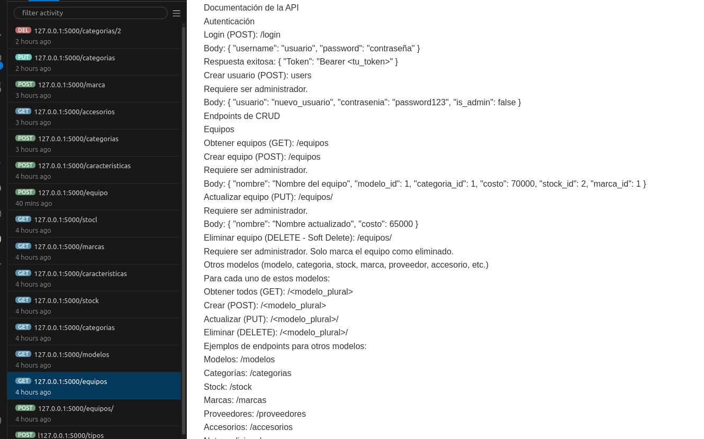

# Proyecto de EFI - Cellphone Store

Este proyecto es una API desarrollada en Flask para gestionar un inventario de equipos y accesorios en una tienda de teléfonos celulares. La API incluye endpoints para manejar operaciones CRUD en equipos, modelos, categorías, marcas, y más. Además, la aplicación utiliza autenticación JWT y puede ejecutarse dentro de un entorno Docker.

## Requisitos previos

- Docker y Docker Compose instalados.
- Archivo `.env` en el directorio raíz con las siguientes variables configuradas:

  ```plaintext
  # Configuración de MySQL
  MYSQL_ROOT_PASSWORD=root
  MYSQL_DATABASE=cellphoneSpStore
  MYSQL_USER=usuario
  MYSQL_PASSWORD=password

  # Configuración de Flask y JWT
  FLASK_APP=app.py
  FLASK_ENV=development
  JWT_SECRET_KEY=super-secret-key

Configuración
Clona el repositorio y accede a la carpeta del proyecto:
bash
Copiar código
git clone <URL_DEL_REPOSITORIO>
cd <CARPETA_DEL_PROYECTO>

2.Asegúrate de tener Docker en funcionamiento. Inicia Docker Desktop (en caso de estar en Windows o Mac).
3.Copia y configura el archivo .env:
Asegúrate de tener el archivo .env con la configuración adecuada de las variables de entorno.
4.Construye y ejecuta los servicios de Docker:
bash
Copiar código
docker-compose up --build
Esto construirá las imágenes de Docker y levantará los contenedores necesarios para la aplicación y la base de datos MySQL.
5.Realiza las migraciones para inicializar la base de datos:
Abre una terminal en el contenedor de la aplicación y ejecuta los siguientes comandos para aplicar las migraciones de la base de datos:
bash
Copiar código
docker-compose exec app bash
flask db init  # Solo si es la primera vez
flask db migrate
flask db upgrade

6.Importa los datos si estás migrando una base de datos existente:
Crea un archivo de volcado (mysqldump) de tu base de datos anterior y guárdalo en el directorio del proyecto como cellphoneSpStore.sql.
Usa el siguiente comando para copiar el archivo al contenedor de la base de datos:
bash
Copiar código
docker cp cellphoneSpStore.sql efipython2-db-1:/cellphoneSpStore.sql


Ingresa al contenedor de la base de datos y ejecuta el volcado:
bash
Copiar código
docker-compose exec db bash
mysql -u root -p cellphoneSpStore < /cellphoneSpStore.sql


Documentación de la API
## Imagen de referencia



Autenticación
Login (POST): /login
Body: { "username": "usuario", "password": "contraseña" }
Respuesta exitosa: { "Token": "Bearer <tu_token>" }
Crear usuario (POST): users
Requiere ser administrador.
Body: { "usuario": "nuevo_usuario", "contrasenia": "password123", "is_admin": false }
Endpoints de CRUD
Equipos
Obtener equipos (GET): /equipos
Crear equipo (POST): /equipos
Requiere ser administrador.
Body: { "nombre": "Nombre del equipo", "modelo_id": 1, "categoria_id": 1, "costo": 70000, "stock_id": 2, "marca_id": 1 }
Actualizar equipo (PUT): /equipos/<id>
Requiere ser administrador.
Body: { "nombre": "Nombre actualizado", "costo": 65000 }
Eliminar equipo (DELETE - Soft Delete): /equipos/<id>
Requiere ser administrador. Solo marca el equipo como eliminado.
Otros modelos (modelo, categoria, stock, marca, proveedor, accesorio, etc.)
Para cada uno de estos modelos:
Obtener todos (GET): /<modelo_plural>
Crear (POST): /<modelo_plural>
Actualizar (PUT): /<modelo_plural>/<id>
Eliminar (DELETE): /<modelo_plural>/<id>
Ejemplos de endpoints para otros modelos:
Modelos: /modelos
Categorías: /categorias
Stock: /stock
Marcas: /marcas
Proveedores: /proveedores
Accesorios: /accesorios
Notas adicionales
Asegúrate de que todos los contenedores estén en ejecución antes de realizar las solicitudes.
En caso de cambios en el esquema de la base de datos, repite los comandos de migración: flask db migrate y flask db upgrade.
Para administrar la base de datos visualmente, accede a phpMyAdmin en http://localhost:8080 (asegúrate de exponer el puerto en el docker-compose.yml si es necesario).


Este README proporciona instrucciones completas para configurar, ejecutar y utilizar la API con Docker y contiene detalles de autenticación y de los endpoints de CRUD.
